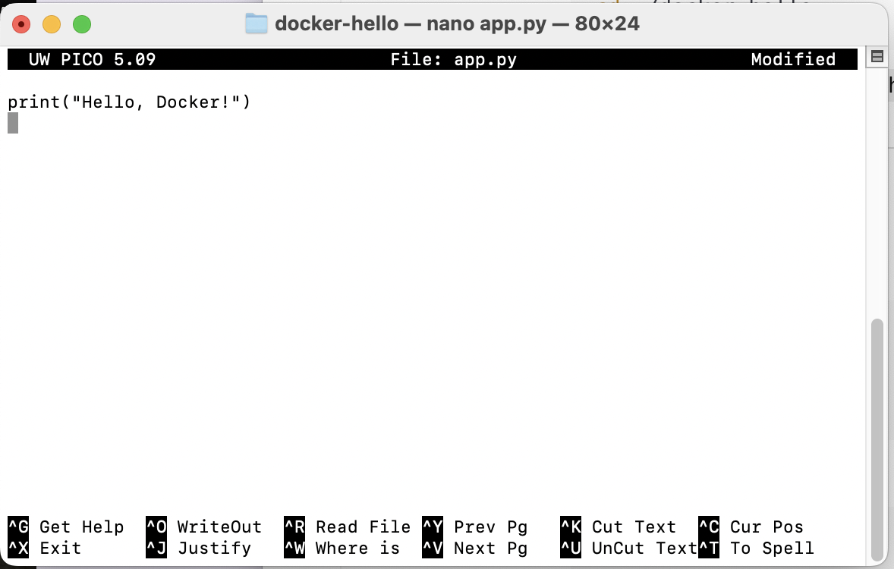
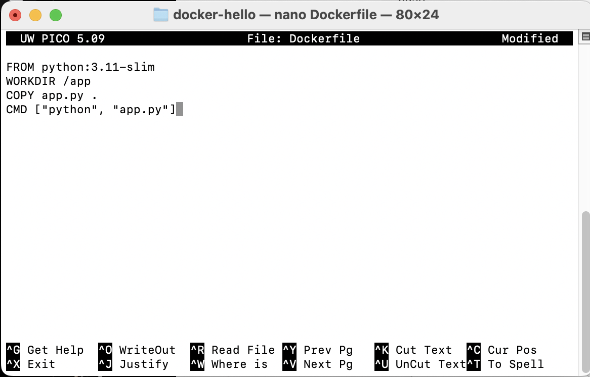
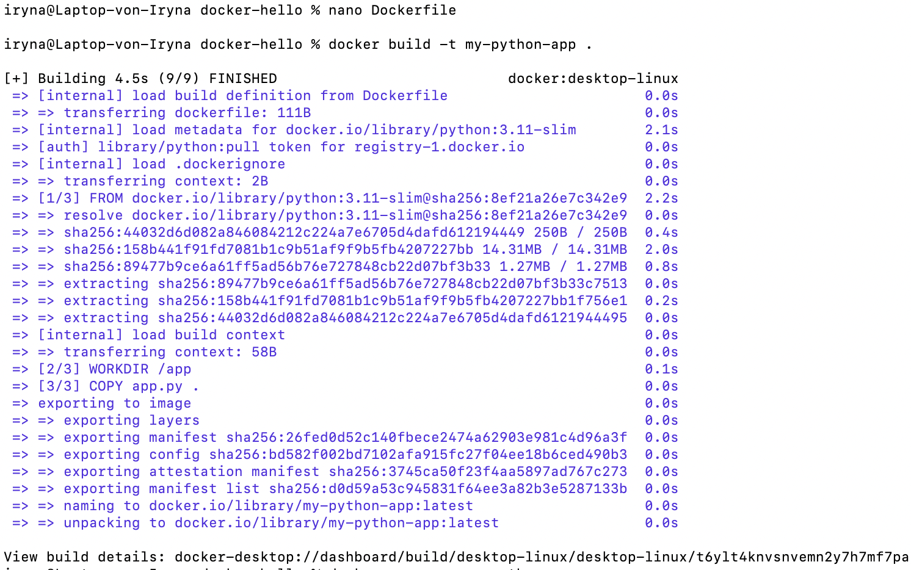
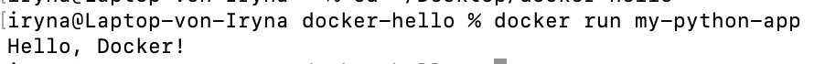

# docker Завдання 3

## - Створити простий Python-файл app.py:

print("Hello, Docker!")

### Результат

## - Написати Dockerfile

### Результат

## - Побудувати образ:

docker build -t my-python-app .

### Результат

## - Запустити контейнер:

docker run my-python-app

### Результат

